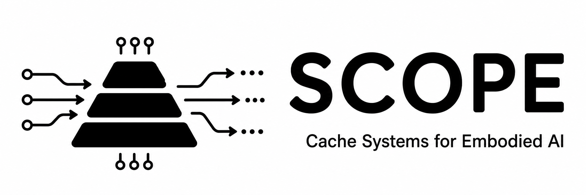

## 1. Overview

SCOPE builds on [DESTINY](https://github.com/sparsh0mittal/destiny_3d_cache) to explore heterogeneous caches for embodied-AI workloads. It connects device and array costs to a three-level cache model, estimating average memory-access latency, memory-system power, conditional hit rates, BER and FoM = 1/(latency × power) for OpenVLA-shaped Attention and FFN workloads.

Configure capacity, device, associativity, banks and sense amplifiers in JSON. The independent `features` switches enable or disable `array_nonideal`, `configurable_peripherals` and `m3d`. v9 uses an Elmore MIV ladder, read/write interconnect energy, and staircase footprint. OSFET BTI refresh is disabled. AsyFET-eDRAM uses the existing TFET device parameters.

The [Orin budget](https://www.nvidia.com/content/dam/en-zz/Solutions/gtcf21/jetson-orin/nvidia-jetson-agx-orin-technical-brief.pdf) is one SM-equivalent 192 KiB L1 and a 4 MiB SRAM-area budget split into 1 MiB-equivalent L2 and 3 MiB-equivalent L3; density determines actual capacities. This is a proposed cache hierarchy, not a cycle-accurate Orin GPU.

Results use synthetic addresses informed by tensor sizes and reuse assumptions, not a measured GPU trace. The inherited configuration exposes its 0.15 L3 OSFET latency scale, 0.88 cross-frame reuse assumption and NoC timing parameters; these are behavioral assumptions. MIV independent conduction current defaults to zero until characterized; nonzero current requires a pulse duration. Array footprint defaults to square bank blocks and accepts explicit dimensions. The reported optimum is among the evaluated candidates.

Original SCOPE contributions use MIT; bundled DESTINY/NVSim/CACTI-3DD retain their licenses (see LICENSE and NOTICE). See CONTRIBUTING for changes and validation.

## 2. Run and example output

Requirements: Python 3.10+ and a C++17 compiler; no third-party Python packages are required.

```bash
make -j2
python3 -m unittest discover -s tests -v
python3 scope.py config/scope_v9.json --compare --json-output results/scope_v9_attention.json
python3 scope.py config/scope_v9.json --workload ffn --compare --json-output results/scope_v9_ffn.json
python3 scripts/v9_reports.py
```

The comparison evaluates S-S-S, S-O-O, S-M-M and S-A-O, plus the three feature ablations. Each architecture evaluates the same L2/L3 search targets (read EDP, read dynamic energy, leakage power) and compatible SAs, selecting the highest feasible system FoM. Generated JSON and Markdown reports stay local. To evaluate one explicit path:

```bash
python3 scope.py config/scope_v9.json --explore --op load --hit-level L3
```

Best cache configuration (Attention; FFN differs):

- L1: SRAM, 192 KiB
- L2: OSFET-eDRAM, 16 MiB
- L3: OSFET-eDRAM, 48 MiB
- Latency: 15.125373 ns (Atten), 20.272265 ns (FFN)
- Power: 13.176186 mW (Atten), 18.986042 mW (FFN)
- FoM: 0.00501769426 (Atten), 0.00259814434 (FFN)

FFN configuration: L1 SRAM 192 KiB, L2 AsyFET-eDRAM 4 MiB, L3 OSFET-eDRAM 48 MiB
